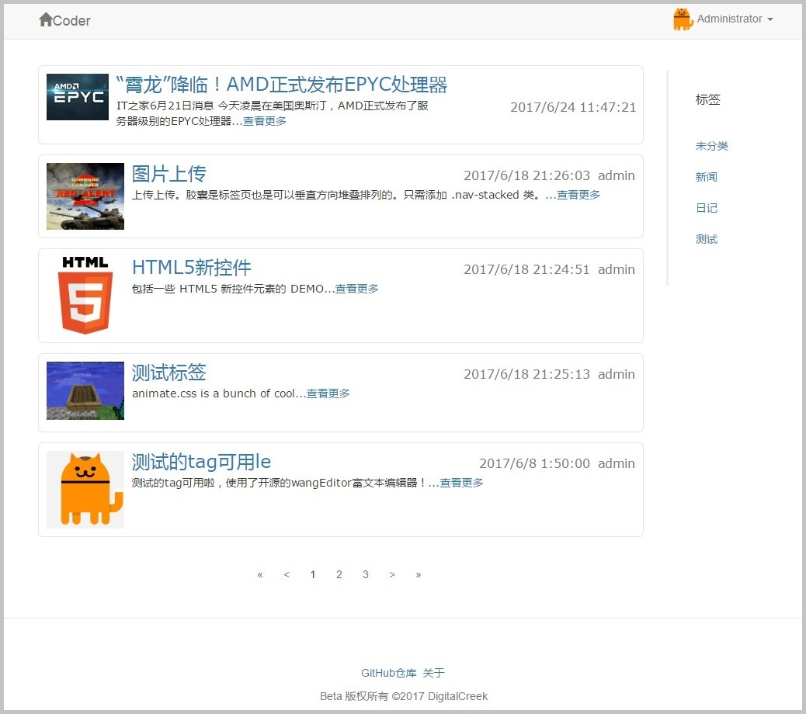
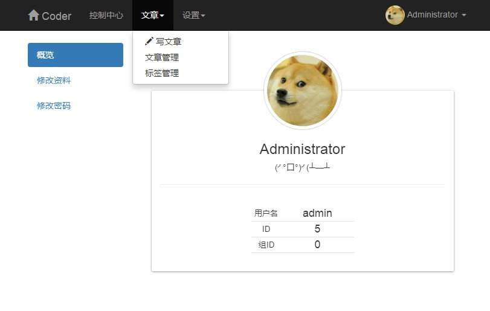

# 轻量级博客 ASP.NET应用 · ASP.NET Light Blog


使用 ASP.NET 实现的轻量级博客应用（实验版）

IDE: VisualStudio 2017

---


## 功能说明 · Feature

* 运行环境 `IIS7+` / `.NET Framework4.0` / `SQL Server 2008 R2`
* 数据库直接导入 `\database_backup\dc_Database.bak` 即可使用
* 默认管理员用户名密码均为`admin`
* 用户可以注册、登录、修改用户信息，普通用户登陆后可发布文章
* 管理员可发布、编辑、修改文章以及修改全局设置
* 文章可按标签分类，文章编辑支持富文本、文章题图上传
* 更多细节请查看[更新日志](README_LOG.md)

---

## 演示截图






---

## Open Source License

```
GNU GENERAL PUBLIC LICENSE Version 3, 29 June 2007
```

```
[Bootstrap](http://v3.bootcss.com/)
[animate.css](https://github.com/daneden/animate.css)
[hover.css](https://github.com/IanLunn/Hover)
[jQuery](https://jquery.com/)
[wangEditor](https://github.com/wangfupeng1988/wangEditor)
```
