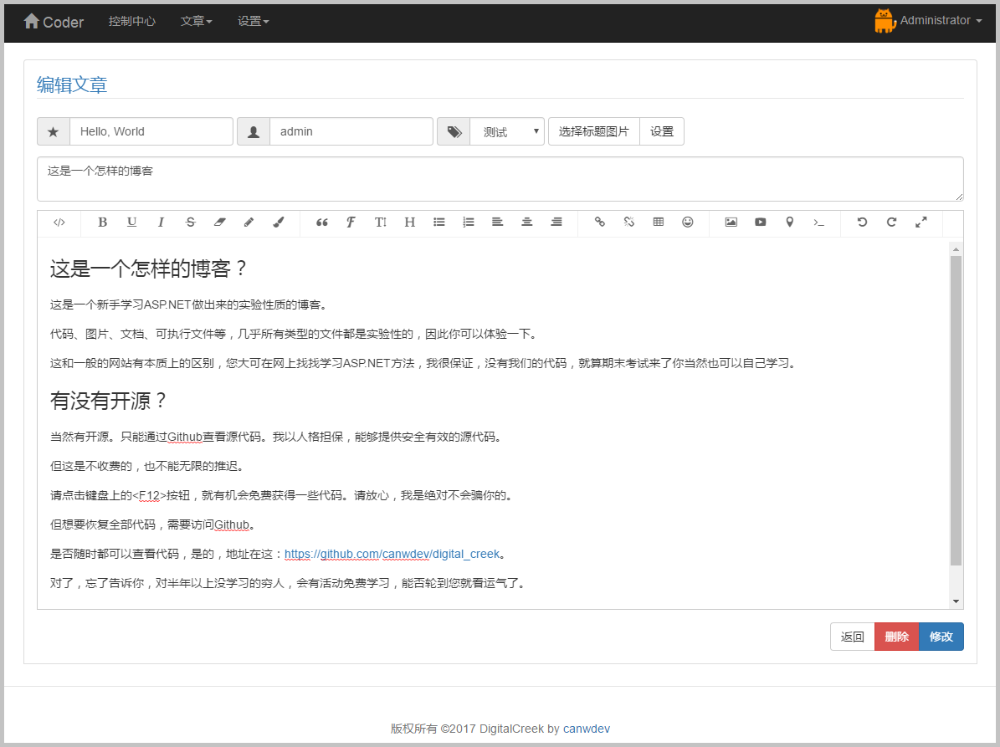
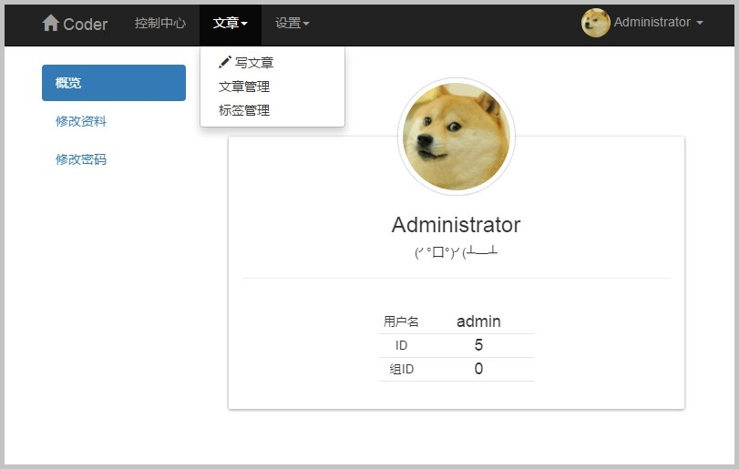
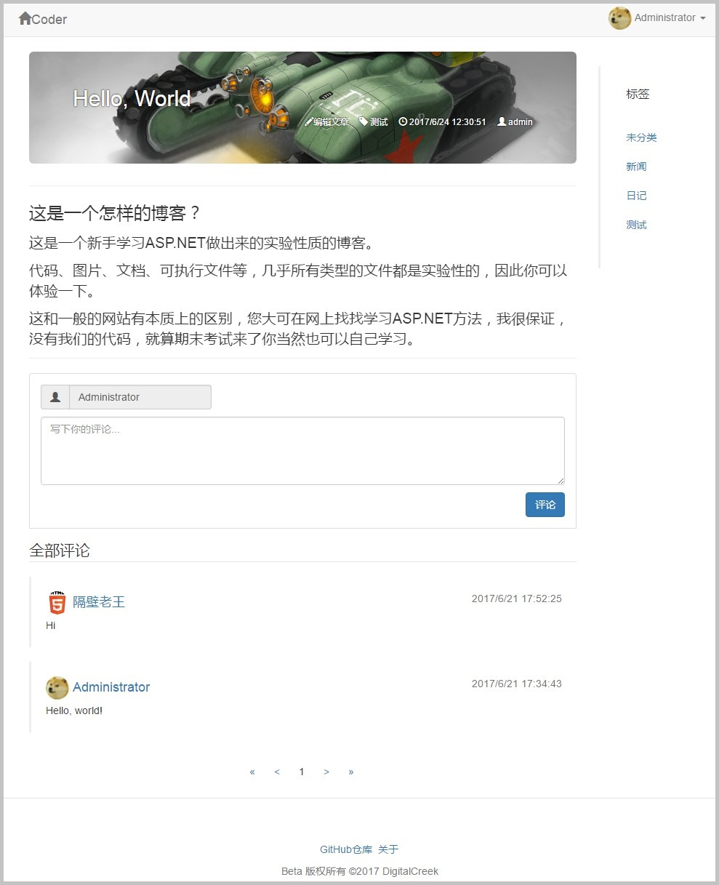

# Digital Creek Lightweight Blog.

## 项目说明
~~~
这是一个用ASP.NET实现的轻量级博客（实验版）
VisualStudio 2017 + SQL Server 2008 R2
~~~

## 演示效果
~~~
[早期的静态页演示效果](https://canwdev.github.io/DigitalCreekDemo)

截图 2017-7-21

~~~

## 更新日志
~~~
2017-6-24
1. 基础评论、评论管理功能实现
2. 提升安全性

2017-6-20
1. 实现首页、文章标题图像上传
2. 实现用户管理，权限区分
3. 优化布局、代码结构

2017-6-12
1. 富文本编辑器本地图片上传，图片将保存至~/res/upload
2. 实现用户注册、用户头像上传为base64存于数据库、用户资料修改
3. 实现系统设置：标题、首页内容、用户注册开关
4. 新增RSA加解密工具、提升用户体验

2017-6-10 & before
1. 管理员注册、登录、修改
2. 文章发布、编辑、删除
3. 标签分类文章
4. 网站设置选项
5. 修复在IIS下不能登录的问题，使用新的秘钥方法
~~~

## 部分目录文件结构 20170621
~~~
digital_creek				根目录		
│  Default.aspx			首页
│  Detail.aspx				文章页
│  index.master			前台模板页
│
├─App_Code
│      DataClasses.dbml			数据库引用
│      DataClasses.dbml.layout
│      DataClasses.designer.cs
│      Js.cs					快速调用JavaScript类
│      Key.cs					存放公钥和私钥
│      RSA.cs					RSA加解密与用户验证
│      dcSettings.cs			加载与存储各种设置
│
├─database_backup			备份
│      dc_Database.bak		SQLServer2008R2数据库备份
│      backup.sql			数据库备份脚本
│      database_model.sql	空白数据库模板
│
├─dc_admin						后台
│    admin.master					后台母版页
│    admin_login.aspx				后台登录页面
│    admin_modify_info.aspx		修改管理员信息
│    admin_settings.aspx			设置
│    admin_users.aspx				用户管理
│    article_addmod.aspx			添加与修改文章
│    article_comment.aspx			评论管理
│    article_list.aspx				显示文章编辑列表
│    article_tag_addmod.aspx		添加与修改文章标签
│    article_tag_list.aspx			显示标签编辑列表
│    debug.aspx					工具箱
│    Default.aspx					后台首页
│    error.aspx					错误页
│    user_info.aspx				用户资料修改
│
├─res					资源文件
│  └─upload			上传图片存放的文件夹

~~~

## 感谢以下开源项目
* [Bootstrap](http://v3.bootcss.com/)
* [animate.css](https://github.com/daneden/animate.css)
* [hover.css](https://github.com/IanLunn/Hover)
* [jQuery](https://jquery.com/)
* [wangEditor](https://github.com/wangfupeng1988/wangEditor)
